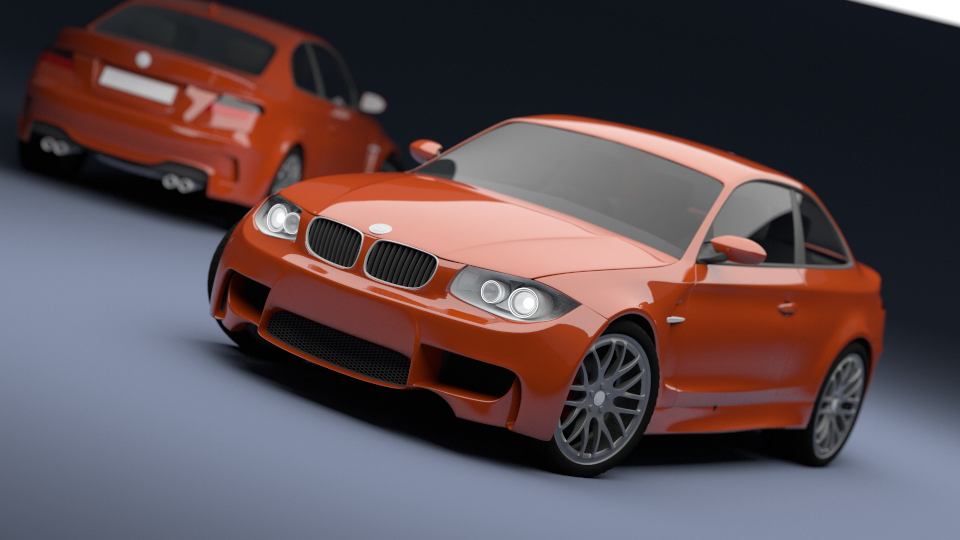
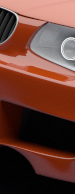

# Example scenes in the tests/ directory

Notes: 

* The directory contains many more scene than are listed here. Some
  might not work, others will need extra data to be downloaded, etc.
* Timings listed are on an Intel(R) Core(TM) i7-6700K CPU @ 4.00GHz
  system with 32 GB RAM running Arch Linux
  
  
### objects.blend 

Features:
- Volumetric data
- Sun light
- A few simple meshes

Path tracer renderer, 960x540, 32 SPP

### cornellbox.blend 

The Stanford Bunny, the Happy Buddha and other iconic computer graphics
models paying tribute to the Cornell Box, the Utah teapot and a golden triangle...

Path tracer renderer, 1920x1080, 256 SPP, 4m10.28s (on a somewhat slower system)

Features:
- Loading external polygon meshes (during render time)
  using the `geometry_assimp` plugin.
- Plugin-generated low-poly proxy meshes
- The Cornell box geometry and light is generated by OSPRay builtin
  "cornellbox" testing scene. All light comes from the single area light
  at the top of the box. 
- Metal material

Note that the scene has a weird orientation in Blender (Y up), as the light in 
the Cornell box part currently cannot be transformed in OSPRay in the same way 
geometry can be transformed. So that single light dictates the rest of the scene at the moment.

Also note that the blend file contains hardly any geometry and is quite small
at 1.1 MB. Total server memory used during rendering is roughly 5.1 GB.

Finally, the teapot model is polygonal and not based on the actual Utah Teapot
parametric surfaces, as the latter are not supported in BLOSPRAY at the moment ;-)

### disney_cloud.blend

Volume rendering of the Disney Cloud dataset. This uses a volume plugin to 
load the data through OpenVDB.

Notes: 

- See the file for instructions on how to download and set up the dataset.
- This example requires the `volume_disney_cloud.so` plugin to be built, which depends
  on OpenVDB and the `PLUGIN_DISNEY_CLOUD` cmake option to be `ON`.
- The reader plugin isn't very advanced currently, as it turns the AMR 
  mesh into a regular structured grid
- With some versions of OpenVDB you need to start the BLOSPRAY server
  with `$ LD_PRELOAD=/usr/lib/libjemalloc.so ./bin/blserver`, see the 
  notes in the blend file for more info.

Path tracer renderer, 960x540, 256 SPP (max. depth 50), 6m05s on the *half-sized* dataset.

Here's the cloud rendered in interactive mode:

### bmw27_cpu.ospray.blend, bmw27_cpu.original.blend

Performance comparison between OSPRay and Cycles. Based on the "Car Demo" test 
scene (CPU version) by Mike Pan, available from https://www.blender.org/download/demo-files/. 

Notes: 

- The original scene was changed to convert all libraries to local objects, plus the
  compositing step was disabled. Note that it seems some of the library
  conversions isn't done correctly in Blender 2.8 (as this is a file created
  with 2.7), leading to a wheel rim that is slightly off, plus a small
  black patch visible in the lower part of the left car door.
- The OSPRay scene was matched in terms of render settings. Shaders and lights
  were manually changed to match the look of the original scene, although
  this is very hard to do perfectly.
- Thanks to Milan Jaros for pointing out at BCON19 that the original bmw scene
  uses the `Square Samples` option.
  
Here's the renders at the same 35^2 (= 1225) samples per pixel:

  

5m35.59s (Cycles) versus 17m55.52s (OSPRay)

This takes much longer in OSPRay, but the comparison isn't fair:
the shaders, light and other settings are different. Even when using
many more samples per pixel the renderings will not converge to the
same image.

So to make a somewhat fairer comparison, here's using 400 samples per pixel 
with OSPRay. The total render time, at 5m50.74s, then is roughly the same 
as for the Cycles original render (5m35.59s) but the noise level is still
a bit higher:

Here's a crop to compare the different noise levels (Cycles at 1225 SPP,
OSPRay at 400 SPP and 1225 SPP):

### gravity_spheres_volume.blend 

Volume rendering of the OSPRay built-in gravity spheres volume.

SciVis renderer, 1024x1024, 4 SPP, 0.42s

The OSPRay command `ospExample -s gravity_spheres_volume` will show the
same dataset, but using the OSPRay example tool.

### dof.blend 

Camera depth-of-field, simple objects.

Path tracer renderer, 960x540, 32 SPP, 3.26s

### lights.blend

All supported light types

Path tracer renderer, 960x540, 64 SPP, 9.45s

### metals.blend 

OSPRay has some really nice metal materials.

Path tracer renderer, 1024x1024, 16 SPP, 2.74s

### plane_geometry.blend, geometry_plane.cpp

Bare bones geometry plugin example and scene using it.

