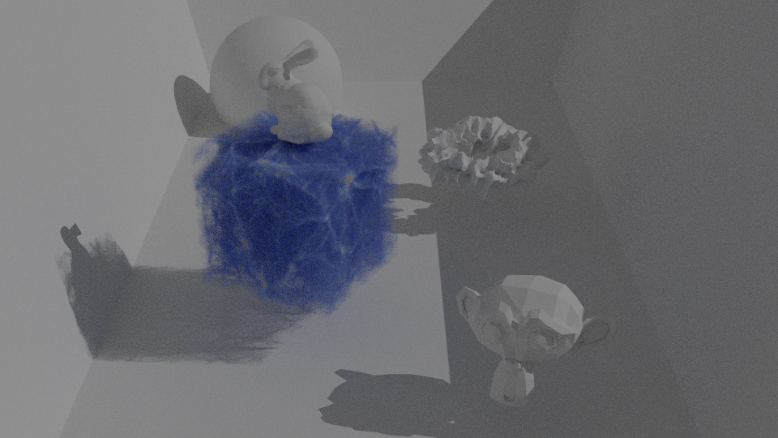
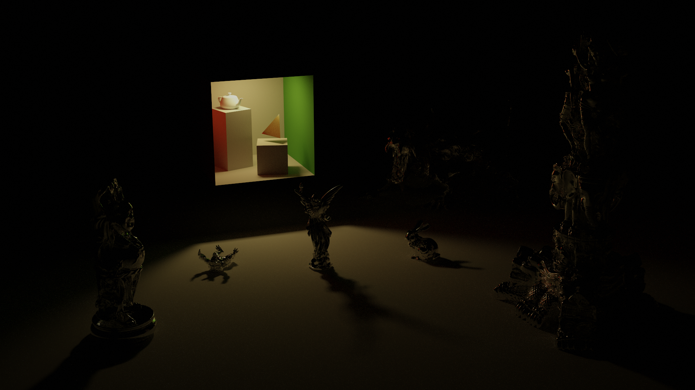
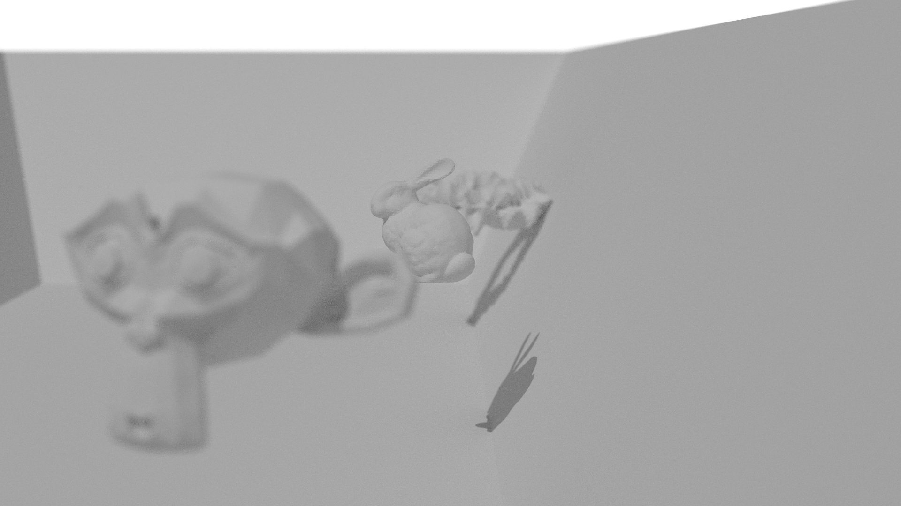
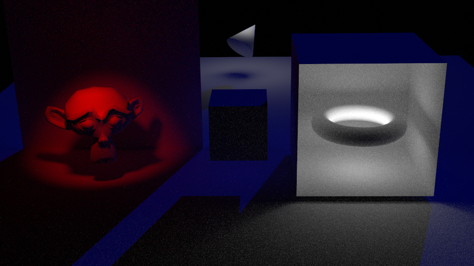
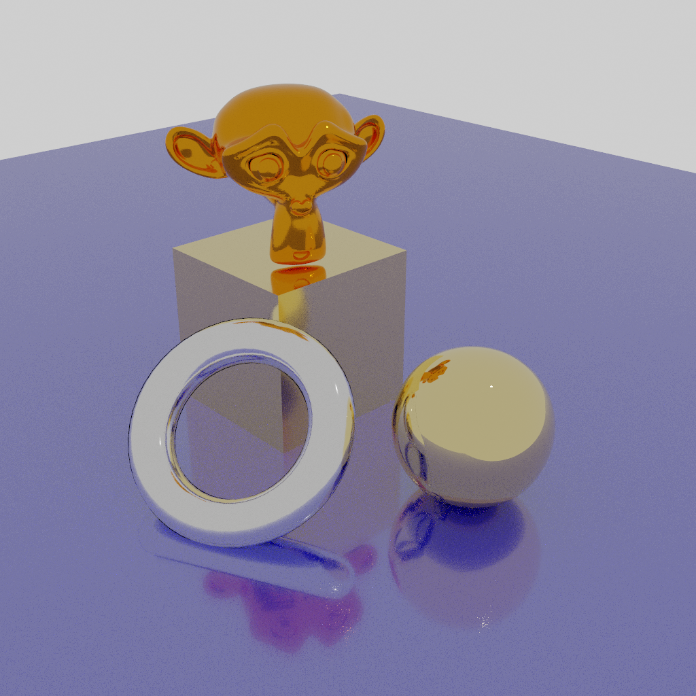
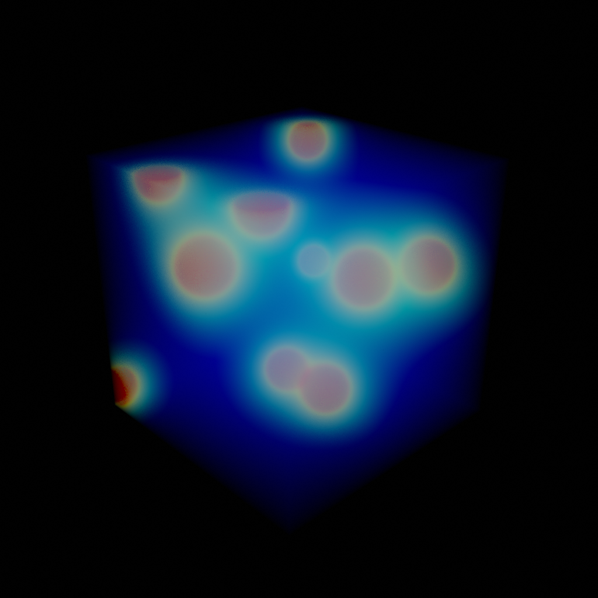
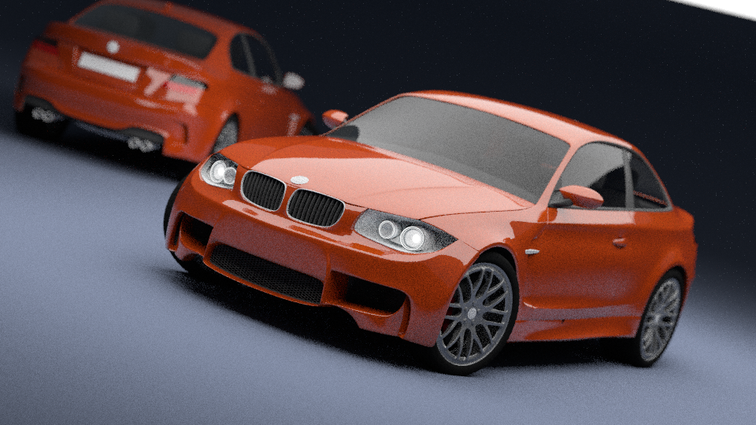
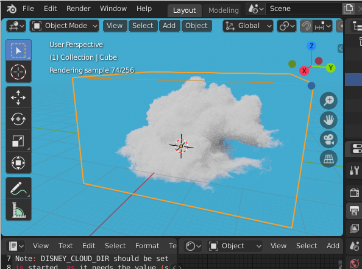

# BLOSPRAY - OSPRay as a Blender render engine

| Blender scene, with proxy object for the volume | Final render by OSPRay through BLOSPRAY |
|-------|--------|
|  |  | 

BLOSPRAY aims to provide high-quality rendering of scientific
data in [Blender](https://www.blender.org) 2.8, with a specific focus on volumetric data and use in
an HPC (High-Performance Computing) context. To accomplish this BLOSPRAY integrates 
the [OSPRay](http://www.ospray.org/) ray tracing engine from Intel in Blender 
as an external renderer.

Currently, this software is somewhere between alpha and beta quality,
as it can already be used to produce useful visualizations, but lots of
things are still incomplete and/or missing. Also, not all errors are robustly
and gracefully handled yet.

In case you give it a try and/or have remarks or questions, let us know
at visualization@surfsara.nl! Bugs and feature requests can be entered 
in this github project.

## Goals 

- Flexible and high-quality rendering of large scientific datasets using OSPRay 
- Provide a way to add user-specific types of data as
  scene elements *without having to import that data into Blender*
- Make OSPRay features available to Blender users

Note that BLOSPRAY does not aim to compete with Cycles (the built-in renderer of Blender),
as it has a different focus. Cycles provides production rendering of animations
and stills, focusing (more or less) on artistic workloads. Instead, BLOSPRAY focuses 
on rendering scenes containing (large) scientific datasets, where 
efficient handling and rendering of the data is usually a more important goal 
and challenge than production of photo-realistic imagery.

## Features & limitations

BLOSPRAY is still in its early stages of development, but the following 
basic functionality and integration with Blender features is already available,
with certain limitations :)

### Features (and known issues)

**Please check this list before reporting a bug for a known issue**

* Scene elements
    - Polygonal geometry, i.e. Blender meshes
    - Subdivision surfaces: these are handled by Blender's dependency graph mechanism,
      but this triangulates the geometry instead of passing the subdivision control
      cage to OSPRay (which also has subdiv support).
    - Currently no specific support for other non-polygonal objects (e.g. text, curves, ...),
      if it works it's due to the dependency graph mechanism
    - Object transformations and parenting
    - Instancing: for large numbers of instances there currently is 
      quite a high overhead in terms of scene setup and memory usage    
    - Point, sun, spot and area lights. No support for OSPRay's HDRI light yet
    - Vertex colors on Blender meshes
    - Node-based material editing for a subset of OSPRay materials,
      using nodes from the `OSPRay` sub-menu. Note that connecting
      nodes to input ports, like a color, will not work as expected 
      when a connection is made (and there is no way to hide the sockets to signal this).
      Also, although most of the Cycles nodes are still available in the
      shader editor almost NONE of those nodes will work.    
* Rendering
    - Supports OSPRay's SciVis and Path Tracer renderers, and most of
      their settings
    - Final render (F12), including canceling
    - Interactive preview render works with respect to viewpoint changes, 
      but most other scene changes will NOT update in the rendered view. 
      Switching out and back into rendered view should sync to the updated scene
    - The view will match in orthographic and "free" view mode, but it is
      incorrect when viewing through a camera
    - Border render (i.e. render only part of an image) currently only works 
      for final render, not for interactive render      
    - Simultaneous rendering modes in Blender are not supported. E.g. multiple
      3D views each in interactive rendering mode will not work as the render
      server does not support this
    - Material/light/... preview rendering does not work
* Rudimentary support for BLOSPRAY-specific volume, geometry and scene plugins      
* Rudimentary transfer function editing for volume data (by mis-using the ColorRamp node)    
* Camera
    - Perspective and orthographic cameras, plus OSPRay's panoramic camera.
      The latter is similar to Cycles' equirectangular camera, but without 
      any parameters to tweak
    - Depth of field
* Blender UI
    - Integration within UI, mostly panels for editing properties and such, 
      is not very advanced
    - The addon provides some UI panels to set OSPRay specific settings, but in other cases we 
      use Blender's [custom properties](https://docs.blender.org/manual/en/dev/data_system/custom_properties.html)
      to pass information to OSPRay. These can even be animated, with certain limitations, 
      but are not a long-term solution. 
    - Note also that some builtin UI panels are disabled when the render engine
      is set to OSPRay as those panels can't directly be used with OSPRay 
      (e.g. they contain Cycles-specific settings)
* This project is developed for Blender 2.8x, the latest stable release.
  Blender 2.7x is not supported
  
Known to be missing and/or buggy:

* When scaling a volume much smaller it appears that the rendered volume is
  "thinned out", i.e. there's much less opacity accumulating. Also, the `Sampling
  rate` parameter appears to have no effect. It needs further checks wether this
  is an issue with BLOSPRAY or with OSPRay.
* Texturing
* HDRI lighting
* Motion blur   
    - This is not supported by OSPRay itself
* Parallel rendering mode through MPI is supported by OSPRay, but not 
  used in BLOSPRAY yet
* Slice rendering and isosurfacing on volumes is not working yet
* Many errors that can happen during scene sync between Blender and
  the render server are not caught and/or not reported correctly  
* In many cases only a subset of OSPRay parameters can be set from Blender, either using UI elements or using custom properties
* Scene management on the render server is not optimal yet. I.e. memory usage might increase after each render.  
* Only a few OSPRay materials can be set through the shader editor. They also don't work on all types of geometry yet.
* Command-line (batch) rendering isn't supported in a nice way yet, as the lifetime of the BLOSPRAY server needs to be managed manually,
  although this isn't a big issue.
* Volumes can only use point-based values, not cell-based values (XXX this is a limitation of the volume_raw plugin)
* All Blender meshes are converted to triangle meshes before being passed to BLOSPRAY, even though OSPRay also supports quad meshes.
  This is partly due to the way the new Blender depsgraph export works.
* Tracking identity of Blender scene objects in a robust way is a challenge, as
  an object's name is about the only thing available. Therefore, renaming scene
  objects while a render is ongoing might trigger funny effects.

OSPRay (currently, 2.0.x alpha) also has some limitations:

* OSPRay's SciVis and Path Tracer renderer do not have the same set of features

    - Only the Path Tracer supports advanced materials, like the principled material
    - The lighting in the SciVis renderer is very basic

* Volumes cannot be transformed properly when using the SciVis rendering

* Volumes are limited in their size, due to the relevant ISPC-based
  code being built in 32-bit mode. See [this issue](https://github.com/ospray/ospray/issues/239).
  
* Unstructured volumes can only contain float values (i.e. not integers).
  See [here](https://github.com/ospray/ospray/issues/289)
  
* Lights generated in a scene plugin (see below) can not be transformed
  
* OSPRay meshes are either pure-triangle, pure-quad or subdivision meshes.
  The latter can mix polygons of different numbers of vertices, but might suffer
  from being less efficient (although this needs more testing).
  
* The OSPRay *orthographic* camera does not support depth-of-field
  
* Blender supports multiple colors per vertex (basically one per vertex per face loop),
  while OSPRay only supports a single value per vertex (XXX need to double-check this). 
  During export the vertex colors are reduced to a single color per vertex
  
* OSPRay does not support motion blur through its API, although the underlying
  Embree library does

* All rendering is done on the CPU, because, well ... it's OSPRay ;-)

## Example scenes in the tests/ directory

Notes: 

* The directory contains many more scene than are listed here. Some
  might not work, others will need extra data to be downloaded, etc.
* Timings listed are on an Intel(R) Core(TM) i7-6700K CPU @ 4.00GHz
  system with 32 GB RAM running Arch Linux
  
  
### objects.blend 

Features:
- Volumetric data
- Sun light
- A few simple meshes

Path tracer renderer, 960x540, 32 SPP




### cornellbox.blend 

The Stanford Bunny, the Happy Buddha and other iconic computer graphics
models paying tribute to the Cornell Box, the Utah teapot and a golden triangle...

Path tracer renderer, 1920x1080, 256 SPP, 4m10.28s (on a somewhat slower system)



Features:
- Loading external polygon meshes (during render time)
  using the `geometry_assimp` plugin.
- Plugin-generated low-poly proxy meshes
- The Cornell box geometry and light is generated by OSPRay builtin
  "cornellbox" testing scene. All light comes from the single area light
  at the top of the box. 
- Metal material

Note that the scene has a weird orientation in Blender (Y up), as the light in 
the Cornell box part currently cannot be transformed in OSPRay in the same was a geometry
can be transformed. So that light dictates the rest of the scene at the moment.

Also note that the blend file contains hardly any geometry and is quite small
at 1.1 MB. Total server memory used during rendering is roughly 5.1 GB.

Finally, the teapot model is polygonal and not based on the actual Utah Teapot
parametric surfaces, as the latter are not supported in BLOSPRAY at the moment ;-)

### dof.blend - camera depth-of-field, simple objects

Path tracer renderer, 960x540, 32 SPP, 3.26s



### lights.blend - all supported light types

Path tracer renderer, 960x540, 64 SPP, 9.45s




### metals.blend - different metals

OSPRay has some really nice metal materials.

Path tracer renderer, 1024x1024, 16 SPP, 2.74s




### gravity_spheres_volume.blend - volume rendering of the OSPRay built-in gravity spheres volume

SciVis renderer, 1024x1024, 4 SPP, 0.42s

The OSPRay command `ospExample -s gravity_spheres_volume` will show the
same dataset, but using the OSPRay example tool.



### bmw27_cpu.ospray.blend, bmw27_cpu.original.blend - performance comparison between OSPRay and Cycles

Based on the "Car Demo" test scene (CPU version) by Mike Pan, available 
from https://www.blender.org/download/demo-files/. 

Notes: 

- The original scene was changed to convert all libraries to local objects, plus the
compositing step was disabled. Note that it seems some of the library
conversions isn't done correctly in Blender 2.8 (as this is a file created
with 2.7), leading to a wheel rim that is slightly off, plus a small
black patch visible in the lower part of the left car door.
- The OSPRay scene was matched in terms of render settings. Shaders and lights
  were manually changed to match the look of the original scene, although
  this is very hard to do perfectly.
  
Here's the renders at the same 35 samples per pixel:




5m35.59s (Cycles) versus 32.31s (OSPRay)

As the OSPRay render is much noisier here's two more renders at
100 and 400 SPP to match the noise level:


1m28.29s (100 SPP) versus 5m50.74s (400 SPP)

Here's a crop to compare the different noise levels (Cycles at 35 SPP,
OSPRay at 35, 100 and 400 SPP):


### disney_cloud.blend - volume rendering of the Disney Cloud dataset

This uses a volume plugin to load the data through OpenVDB.

Notes: 

- See the file for instructions on how to download and set up the dataset.
- This example requires the `volume_disney_cloud.so` plugin to be built, which depends
  on OpenVDB and the `PLUGIN_DISNEY_CLOUD` cmake option to be `ON`.
- The reader plugin isn't very advanced currently, as it turns the AMR 
  mesh into a regular structured grid
- With some versions of OpenVDB you need to start the BLOSPRAY server
  with `$ LD_PRELOAD=/usr/lib/libjemalloc.so ./bin/blserver`, see the 
  notes in the blend file for more info.

Path tracer renderer, 960x540, 256 SPP (max. depth 50), 6m05s on the *half-sized* dataset.


Here's cloud rendered in interactive mode:




### plane_geometry.blend, geometry_plane.cpp

Bare bones geometry plugin example and scene using it.

## Workflow

The overall idea is to use Blender to set up the scene to render in the usual way.
Regular Blender meshes are handled mostly correct, although Blender's Cycles
and EEVEE materials are currently not exported. A subset of the materials
supported by OSPRay is available, though.

To make use of (BL)OSPRAY-specific features a "plugin" can be enabled on a 
normal mesh object. This plugin generates OSPRay-specific scene elements 
that are handled independently from Blender. Examples of such elements are 
volumetric data or point sets.

There are currently 3 types of plugins in BLOSPRAY:

- Geometry plugins: these generate a single `OSPGeometry`, such as OSPRay's "spheres"
  "streamlines" or an "isosurface". 
  
- Volume plugins: these load (or generate) volumetric data in the form of an `OSPVolume`.
  Note that OSPRay supports regular volumetric grids, but also ununstructured grids
  and AMR meshes. 

- Scene plugins: these can generate any set of `OSPInstance` elements, plus
  zero or more lights.

Meshes that have a plugin attached can be transformed in the Blender scene 
in the usual way. Meshes with a volume plugin have a few more options
specific to volumes: 

- Note: the two options below are currently broken in 0.1!

- One or more isosurfaces can be rendered through the volume

- Slicing through the volume data with a separate set of slicing meshes. These
  meshes must be attached as children to the mesh data that has the volume plugin
  attached

All types of plugins can provide a proxy mesh, such as a bounding box or 
simplified mesh, to be used as proxy in the Blender scene.

See the Plugin section below for more details.

## Render server

BLOSPRAY consists of two parts:

1. A Blender addon (directory `render_ospray`) that implements the Blender external render engine. It handles scene export to OSPRay, retrieving the rendered image from OSPRay and other things.
2. A standalone render server (`bin/blserver` after building) that receives the scene from Blender, calls OSPRay routines to do the actual rendering and sends back the image result.

The original reason for this two-part setup is that there currently is no 
Python API for OSPRay, so direct integration in Blender is not straightforward. 
Neither is there a command-line OSPRay utility that takes as input a scene 
description in some format and outputs a rendered image. 

Plus, the client-server setup also has some advantages:

- The separate render server can be run on a remote system, for example an HPC system 
  that holds a large scientific dataset to be rendered. This offloads most of the 
  compute-intensive rendering workload and memory/storage requirements of the data to be rendered 
  away from the (desktop) system running Blender.

- It makes it feasible to use OSPRay's [Parallel Rendering with MPI](http://www.ospray.org/documentation.html#parallel-rendering-with-mpi) 
  mode, by providing a variant of the render server as an MPI program. Again,
  this parallel version of the server can be run remotely on an HPC system.
  Note that this mode is currently not implemented yet.

- The network protocol is currently not strongly tied to Blender, so the render server can be used in other contexts as well.

- BLOSPRAY development becomes slightly easier as both Blender and the render 
  server can be independently restarted in case of crashes or bugs.

Of course, this client-server setup does introduce some overhead, in terms of 
network latency and data (de)serialization and transfer. But in practice this overhead is 
small compared to actual render times. Caching of data on the server 
between renders helps reducing the overhead even further. However, for scenes with
thousands of objects, or where objects are instanced in large numbers the
network overhead will become noticeable (and sometimes even prohibitive).

Note that the render server currently doesn't support loading multiple different 
Blender scenes or serving different users at the same time. There is also 
a manual action required to start/stop the render server.

## Plugins

There is a rudimentary plugin system that can be used to set up
custom scene elements that are represented by a proxy object in Blender,
but whose full representation and rendering is stored on the server side
in OSPRay. The original use case for plugins (and even BLOSPRAY itself) was
to make it easy to use OSPRay's high-quality volume rendering of scientific data in a 
Blender scene. Blender's own volume rendering support is geared towards the built-in 
smoke and fire simulations and isn't really a good fit for scientific datasets.
Plus it is very hard to get more advanced volume data (e.g. AMR meshes) into Blender.

Apart from volumes, plugins can be used for other types of scene content as well, 
like polygonal geometry or OSPRay's builtin geometry types like spheres and
streamlines. Basically any scene element that can be created with the OSPRay API
can potentially be used during rendering through plugins.

The plugin system is especially useful when working with large scientific datasets 
for which it is infeasible or unattractive to load into Blender. Instead, one 
can use a proxy object, such as a cube mesh to represent a rectangular volume, 
in a Blender scene and attach a plugin to it. During rendering BLOSPRAY will call the 
plugin on the server to load the actual scene data associated with the proxy. 
In this way Blender scene creation, including camera animation and lighting, can be 
done in the usual way as the proxy object shows the bounding box of the data 
and can even be transformed and animated.

A nice benefit of writing a plugin in C++ is that it allows one to load a large 
dataset directly into memory, without having to go through the
Blender Python API in order to accomplish the same. The latter is usually
less efficient.

Note that BLOSPRAY plugins are different from OSPRay's own [Extensions](http://www.ospray.org/documentation.html#loading-ospray-extensions-at-runtime), 
that are also loadable at run-time. The latter are meant for extending OSPRay itself
with, for example, a new geometry type. BLOSPRAY plugins serve to extend *Blender*
with new types of scene elements that are then rendered in OSPRay.

## Dependencies

For building:

* [OSPRay 2.x](http://www.ospray.org/), which is currently still in development.
  Use the `release-2.0.x` branch from https://github.com/ospray/ospray.
* [GLM](https://glm.g-truc.net/0.9.9/index.html)
* [OpenImageIO](https://sites.google.com/site/openimageio/home)
* [Google protobuf (C/C++ libraries)](https://developers.google.com/protocol-buffers/)

* The code uses the [JSON for Modern C++](https://github.com/nlohmann/json) library,
  which is included in the sources
  
For the plugins:

* volume_disney_cloud: [OpenVDB](https://www.openvdb.org/) 
* geometry_assimp: [Open Asset Import Library](http://www.assimp.org/). Plus [VTK](https://www.vtk.org)
  when the `VTK_QC_BOUND` option is enabled
* scene_cosmogrid and volume_hdf5: [uHDF5](https://github.com/paulmelis/uhdf5) and [HDF5](https://www.hdfgroup.org/solutions/hdf5/)

For running the BLOSPRAY addon in Blender:

* Numpy, which must available in Blender (try `import numpy` in a Python console area)
* Google protobuf (Python modules), see Installation below

## Building

Note: BLOSPRAY is only being developed on Linux at the moment, on other 
platforms it might only work after some code tweaks.

BLOSPRAY uses CMake for building in the usual way. There's currently 
only a very small set of BLOSPRAY specific switches that can be tweaked.

The current way to build BLOSPRAY is to make a build directory within
the source directory and build there. A `make install` will then place
all files (server, plugins, test files) in a `bin` subdirectory of the sources:

```
$ cd blospray
$ mkdir build
$ cd build
$ cmake -GNinja ..
# Configure, Generate
$ ninja install
$ cd ../bin
$ ls
blserver            libblospray.so      plugin.h             scene_rbc.so    volume_testing.so
geometry_assimp.so  libblospray.so.0.2  scene_boxes.so       t_json
geometry_plane.so   libblospray.so.1    scene_cornellbox.so  volume_hdf5.so
geometry_ply.so     libfaker.so         scene_cosmogrid.so   volume_raw.so
```

## Installation

Part of BLOSPRAY consists of the Blender add-on, but this is not being distributed separately
as the focus currently is getting to a releasable state in terms of features.
Currently, the way to install the add-on is to clone this repository and then
make a symlink to the `render_ospray` directory in the Blender addon directory:

```
$ cd <blender-2.8>/2.80/scripts/addons
$ ln -sf <blospray-repo>/render_ospray render_ospray
```

If needed, make Blender find the necessary protobuf dependencies by adding 
symlinks to `google` and `six.py` in Blender's python library dir:

  ```
  $ cd <blender-2.8>/2.80/python/lib/python3.7/site-packages
  $ ln -sf /usr/lib/python3.7/site-packages/six.py six.py
  $ ln -sf /usr/lib/python3.7/site-packages/google google
  ```

Finally, enable the `Render: OSPRay` add-on in Blender (`Edit -> Preferences -> Add-ons`). 

You should now have a new `OSPRay` entry in the `Render Engine` 
dropdown on the `Render` properties tab. If not, check for error messages
in the console window where Blender is running.

## Usage

1. Start the server (`./bin/blserver` and keep it running)
2. Start Blender
3. Set the `Render Engine` to `OSPRay`

## Licenses

BLOSPRAY is licensed under the Apache License, version 2.0 (the same
license as OSPRay). See LICENSE-2.0.txt for more information.

BLOSPRAY uses the [JSON for Modern C++](https://github.com/nlohmann/json) 
header-only library, which is included in this source distribution
as `core/json.hpp`. This file is not part of BLOSPRAY and has a different 
license, see its contents.

Some files, mostly separate test files, are not part of BLOSPRAY
itself. These files have license information included in their text,
where appropriate. 

The file `tests/teapot.obj` is based on the Teapot model from 
the [McGuire Computer Graphics Archive](https://casual-effects.com/data/).
The separate meshes in the file were combined into a single one. 

The file `tests/ss002.128_3.bin.vtk` is derived from the Cosmogrid 512^3 
simulation by Ishiyama et al. available at https://repository.surfsara.nl/datasets/cosmogrid/648.
One shapshot of the original particle data was mapped to a density 
volume (log10 of 1+#particles) at 128^3. The original data is covered 
by an MIT license for which the following holds:

> Copyright 2011 Tomoaki Ishiyama, Steven Rieder, Junichiro Makino, 
> Simon Portegies Zwart, Derek Groen, Keigo Nitadori, Cees de Laat, 
> Stephen McMillan, Kei Hiraki, Stefan Harfst
>
> Permission is hereby granted, free of charge, to any person obtaining
> a copy of this software and associated documentation files (the "Software"), 
> to deal in the Software without restriction, including without 
> limitation the rights to use, copy, modify, merge, publish, distribute, 
> sublicense, and/or sell copies of the Software, and to permit persons 
> to whom the Software is furnished to do so, subject to the following 
> conditions:
>
> The above copyright notice and this permission notice shall be included in all 
> copies or substantial portions of the Software.
>
> THE SOFTWARE IS PROVIDED "AS IS", WITHOUT WARRANTY OF ANY KIND, 
> EXPRESS OR IMPLIED, INCLUDING BUT NOT LIMITED TO THE WARRANTIES OF 
> MERCHANTABILITY, FITNESS FOR A PARTICULAR PURPOSE AND NONINFRINGEMENT. 
> IN NO EVENT SHALL THE AUTHORS OR COPYRIGHT HOLDERS BE LIABLE FOR ANY
> CLAIM, DAMAGES OR OTHER LIABILITY, WHETHER IN AN ACTION OF CONTRACT, 
> TORT OR OTHERWISE, ARISING FROM, OUT OF OR IN CONNECTION WITH THE 
> SOFTWARE OR THE USE OR OTHER DEALINGS IN THE SOFTWARE.

